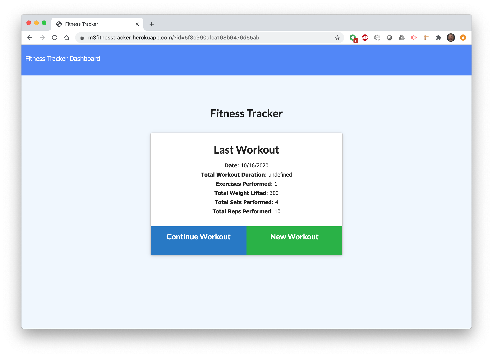
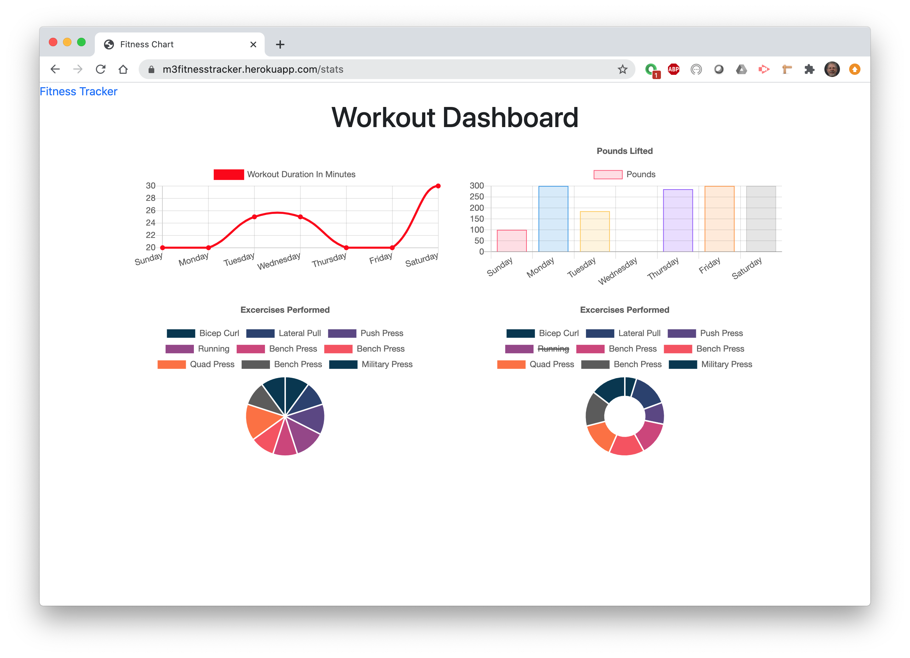

# workout-tracker
MongoDB with Mongoose ORM homework (week 17)
## Description
A noSQL database for keeping track of fitness workouts with an array of exercises contained in each workout. All the exercises of daily workout can be recorded and or edited for accurate tracking. 

Github repo: https://github.com/macksm3/workout-tracker 

Heroku live app: https://m3fitnesstracker.herokuapp.com 

## Table of Contents 

* [Installation](#installation)
* [Usage](#usage)
* [Contributers](#contributers)
* [License](#license)

## Installation
This app resides on the Heroku server and is accessed with a web browser.

## Usage
ALl the exercises of your daily workout are entered using resistance or cardio catagories, with details on sets, reps, & weights for resistance and distance/duration for cardio. A dashboard page will show progress. 

## License
GPLv3.

## Badges

[
(https://www.gnu.org/licenses/gpl-3.0)

